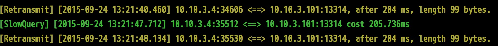
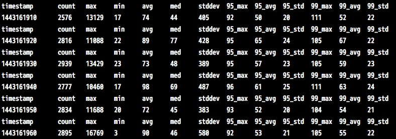

                                 ~ tcprstat ~

tcprstat is a pcap-based tool that extracts information about TCP response
times.

It works by sniffing for TCP "requests" (inbound packets) and measures the time
that it takes for sending a "response" (next outbound packet). While this
approach might seem too simple, it works for simple protocols that are based in
such request/response system, like HTTP and the MySQL protocol. In the future,
we may write more complex protocol decoding.

tcprstat sniffs for a while, and then shows some stats about the sniffed
packets, similar to the way top(1) works.

tcprstat uses libpcap to capture TCP. Due to many distros not shipping
libpcap >= 1.0.0, tcprstat ships libpcap 1.1.1 and uses it if it can't find a
suitable version

The build process delivers a static version, tcprstat-static, with no external
linking (some castration is needed at libpcap) so it can be copied directly to
a server with no need for compilation tools.

tcprstat is released under the GPL, version 2 or 3.


```shell
################################################################################
#                                                                              #
#   tcprstat -- Extract stats about TCP response times                         #
#   Copyright (C) 2010  Ignacio Nin                                            #
#                                                                              #
#   This program is free software; you can redistribute it and/or modify       #
#   it under the terms of the GNU General Public License as published by       #
#   the Free Software Foundation; either version 2 of the License, or          #
#   (at your option) any later version.                                        #
#                                                                              #
#   This program is distributed in the hope that it will be useful,            #
#   but WITHOUT ANY WARRANTY; without even the implied warranty of             #
#   MERCHANTABILITY or FITNESS FOR A PARTICULAR PURPOSE.  See the              #
#   GNU General Public License for more details.                               #
#                                                                              #
#   You should have received a copy of the GNU General Public License          #
#   along with this program; if not, write to the Free Software                #
#   Foundation, Inc.,                                                          #
#   51 Franklin Street, Fifth Floor, Boston, MA  02110-1301  USA               #
#                                                                              #
################################################################################

```

### 1) install
#### 1.1 Linux

```shell
$ chmod +x bootstrap
$ ./bootstrap
$ ./configure
$ sudo make && make install
```

### 2) Options

#### 2.1 retransmit and slow query

```shell
-T threshod (ms), when query is slower than threshod will be printed.

-d remote address, it's needed when tcprstat is used in client side.

-p remote/local port, treat as remove port in client, and as local port in server side.

-l localaddress, we need it as libpcap may failed while ethernet is bond.
```

#### 2.2 query summary

```shell
--interval <seconds>, -t Output interval. Default is 10.
--read <file>, -r        Capture from pcap file <file>, not live.
--iterations <n>,     -n Output iterations. Default is 1, 0 is infinity
--help                   Shows program information and usage.
--version                Shows version information.
```

### 3) How to use

#### 3.1 use in client side
When tcprstat is used in client side, it's used to monitor retransmits and slow querys. It records when packet is sent, and caculated cost time when response is received.

Client slow query and retransmit example.

```shell
sudo tcprstat -d 192.168.3.1 -p 13314 -T 50  -l 192.168.3.4
``` 

`-T 50` is mean to print message when cleint send request and receive response cost more than 50 ms. 

`-l 192.168.3.4` is local address, as libpcap may failed while ethernet is bond.

`-d 192.168.3.1` is destination address to monitor, like mc, redis...

`-p 13314` is destination port to monitor

result looks like below, one slow query and two retranmits.



#### 3.2 use in server side

When tcprstat is used in server side, it's used to catch slow query by record when request is received and response is sent.

Server slow query and retransmit example.

```shell
sudo tcprstat -p 13314 -T 50  -l 192.168.3.1
```

Server query summary example.

```shell
sudo tcprstat -p 13314 -t 10 -n 10 -l 192.168.3.1
```

Dump query summary every 10 seconds, stop after 10 times.



